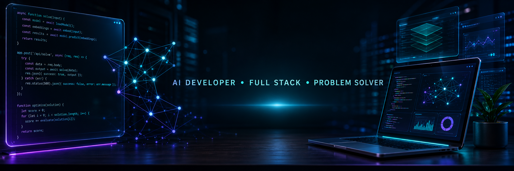

<div align="center">



<br />

<a href="https://github.com/sourav7-1">
  
</a>
<a href="https://www.linkedin.com/in/sourav-kundu-samya-387496367/">
  
</a>
<a href="mailto:souravku0416@gmail.com">
  
</a>

<br /><br />


<br />


</div>

## `> whoami`

```yaml
name: Sourav Kundu Samya
education: B.Sc. in Computer Science & Engineering
university: Daffodil International University
focus:
  - Artificial Intelligence & Machine Learning
  - Remote Sensing, GIS & GeoAI
  - Computer Vision & Satellite Image Analysis
  - Full Stack Development
currently_building: AI-powered Satellite Tree Monitoring System
currently_learning: [Deep Learning, GeoAI, MLOps, LLMs]
mission: Turn satellite data into practical environmental intelligence
```

## About me

- 🛰️ I build workflows with **Google Earth Engine**, **Sentinel-2**, GIS and remote-sensing data.
- 🌳 My current work explores AI-assisted tree, vegetation and land monitoring from satellite imagery.
- 🧠 I enjoy turning machine-learning ideas into useful, end-to-end applications.
- 🌐 I build web tools with Python, Flask, JavaScript and databases.
- 🎯 I care about clean engineering, automation and technology with real-world impact.

## Technology constellation

<div align="center">

### Languages & web


### AI, data & vision


`NumPy` · `Pandas` · `Computer Vision` · `Image Processing` · `Predictive Modelling`

### Geospatial engineering

`Google Earth Engine` · `Sentinel-2` · `GeoTIFF` · `Raster Processing` · `Leaflet` · `OpenStreetMap` · `Spatial Analysis`

### Data & tools


</div>

## Featured work

<table>
<tr>
<td width="50%" valign="top">

### 🌳 AI Satellite Tree Monitoring

An AI-assisted platform for vegetation monitoring and environmental analysis using satellite imagery.

**Highlights**

- Interactive map-based area selection
- Google Earth Engine integration
- Sentinel-2 search and cloud filtering
- Multi-band GeoTIFF export
- Vegetation analytics and visualization

`Python` `Flask` `Earth Engine` `Sentinel-2` `Leaflet`

</td>
<td width="50%" valign="top">

### 🛰️ Sentinel-2 Automation Pipeline

An end-to-end workflow that collects, filters and prepares satellite imagery for AI analysis.

**Pipeline**

`ROI → Validation → Cloud Mask → Best Image → GeoTIFF → AI-ready data`

- Date and coordinate validation
- Acquisition metadata extraction
- Export tracking and preview layers

`Remote Sensing` `GIS` `Automation` `GeoTIFF`

</td>
</tr>
<tr>
<td width="50%" valign="top">

### 🎓 Student360 AI

An AI-powered student ecosystem designed to support academic planning, learning and career preparation.

- Course recommendations and academic planning
- GPA insights and exam preparation
- Campus navigation and productivity tools
- Career-assistance concepts

`AI` `Machine Learning` `Python` `Web`

</td>
<td width="50%" valign="top">

### 🏦 ZEN Bank Tracker

A responsive lending and borrowing tracker for managing personal financial records.

- Borrowed and lent money tracking
- Transaction history and record management
- Lightweight SQLite persistence
- Responsive interface

`Python` `Flask` `SQLite` `HTML` `CSS` `JavaScript`

</td>
</tr>
<tr>
<td width="50%" valign="top">

### 🤖 Human Following Robot

An embedded robotics project for detecting and following a person while avoiding obstacles.

`Arduino` `Ultrasonic Sensors` `Motor Driver` `Embedded Logic`

</td>
<td width="50%" valign="top">

### 🔐 Digital Combination Lock

A secure combination-lock design built from digital-logic and sequential-circuit concepts.

`Logic Gates` `Flip-Flops` `Sequential Circuits` `Security Logic`

</td>
</tr>
</table>

<div align="center">

[](https://github.com/sourav7-1?tab=repositories)

</div>

## Current direction

```text
Artificial Intelligence   ███████████████████░   Building intelligent systems
Remote Sensing & GIS      ███████████████████░   Reading the Earth from space
Machine Learning          █████████████████░░░   Learning from real-world data
Computer Vision           ████████████████░░░░   Understanding pixels at scale
Full Stack Development    ███████████████░░░░░   Shipping complete experiences
```

## GitHub telemetry

<div align="center">

<picture>
  <source media="(prefers-color-scheme: dark)" srcset="https://github-readme-stats.vercel.app/api?username=sourav7-1&show_icons=true&theme=transparent&hide_border=true&title_color=22D3EE&text_color=C9D1D9&icon_color=10B981&ring_color=8B5CF6&rank_icon=github" />
  <source media="(prefers-color-scheme: light)" srcset="https://github-readme-stats.vercel.app/api?username=sourav7-1&show_icons=true&theme=transparent&hide_border=true&title_color=0369A1&text_color=24292F&icon_color=059669&ring_color=7C3AED&rank_icon=github" />
  
</picture>
<picture>
  <source media="(prefers-color-scheme: dark)" srcset="https://github-readme-stats.vercel.app/api/top-langs/?username=sourav7-1&layout=compact&hide_border=true&theme=transparent&title_color=22D3EE&text_color=C9D1D9" />
  <source media="(prefers-color-scheme: light)" srcset="https://github-readme-stats.vercel.app/api/top-langs/?username=sourav7-1&layout=compact&hide_border=true&theme=transparent&title_color=0369A1&text_color=24292F" />
  
</picture>

<br />

<picture>
  <source media="(prefers-color-scheme: dark)" srcset="https://streak-stats.demolab.com?user=sourav7-1&theme=transparent&hide_border=true&ring=22D3EE&fire=10B981&currStreakLabel=8B5CF6&sideLabels=C9D1D9&dates=8B949E" />
  <source media="(prefers-color-scheme: light)" srcset="https://streak-stats.demolab.com?user=sourav7-1&theme=transparent&hide_border=true&ring=0369A1&fire=059669&currStreakLabel=7C3AED&sideLabels=24292F&dates=57606A" />
  
</picture>

<br />

<picture>
  <source media="(prefers-color-scheme: dark)" srcset="https://github-readme-activity-graph.vercel.app/graph?username=sourav7-1&bg_color=00000000&color=22D3EE&line=10B981&point=8B5CF6&area=true&hide_border=true" />
  <source media="(prefers-color-scheme: light)" srcset="https://github-readme-activity-graph.vercel.app/graph?username=sourav7-1&bg_color=00000000&color=0369A1&line=059669&point=7C3AED&area=true&hide_border=true" />
  
</picture>

</div>

## Contribution orbit

<div align="center">

<picture>
  <source media="(prefers-color-scheme: dark)" srcset="https://raw.githubusercontent.com/sourav7-1/sourav7-1/output/github-contribution-grid-snake-dark.svg" />
  <source media="(prefers-color-scheme: light)" srcset="https://raw.githubusercontent.com/sourav7-1/sourav7-1/output/github-contribution-grid-snake.svg" />
  
</picture>

</div>

## Let's connect

<div align="center">

I'm open to learning, collaboration and conversations about AI, GeoAI, remote sensing and useful software.

<br />

[](https://github.com/sourav7-1)
[](https://www.linkedin.com/in/sourav-kundu-samya-387496367/)
[](mailto:souravku0416@gmail.com)

<br /><br />

> **Turning satellite data into actionable intelligence with AI.**

<sub>Code · Learn · Build · Improve · Repeat</sub>

</div>
