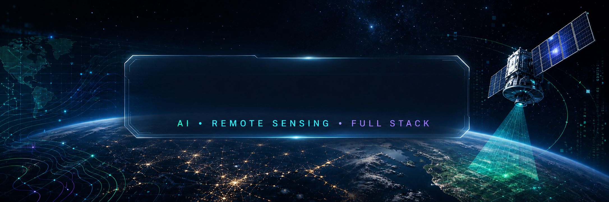

<div align="center">



# Sourav Kundu Samya

### CSE Student · Backend Developer · AI & GeoAI Enthusiast

<p>
  <a href="https://github.com/sourav7-1">
    
  </a>
  <a href="https://www.linkedin.com/in/sourav-kundu-samya-387496367/">
    
  </a>
  <a href="mailto:souravku0416@gmail.com">
    
  </a>
</p>


<br/>


</div>

---

## 👋 About Me

I'm a **Computer Science & Engineering student at Daffodil International University** interested in building practical software systems across **backend development, database engineering, artificial intelligence, remote sensing and geospatial applications**.

I enjoy working on projects where software, data and real-world problems come together — from designing relational databases and backend systems to processing satellite imagery for environmental intelligence.

### What I work with

* 🔧 Backend & web application development
* 🗄️ Relational database design and SQL
* 🤖 Artificial Intelligence & Machine Learning
* 🛰️ Remote Sensing & GeoAI
* 👁️ Computer Vision & Image Processing
* 🌐 Full-stack web technologies
* ⚙️ Automation and data-processing pipelines

### Currently exploring

`Deep Learning` · `GeoAI` · `MLOps` · `LLM Applications` · `Advanced Computer Vision`

---

# 🚀 Featured Projects

## 🍽️ Smart Street Food Safety Inspection & Risk Analysis System

A **database-driven food safety management platform** designed to centralize information about food vendors, food stalls, inspections, hygiene conditions, complaints and safety risks.

The system focuses heavily on **database engineering and backend-driven data management**.

### What it does

* 🏪 Vendor and food-stall management
* 🍜 Food and food-category management
* 🔍 Food-safety inspection management
* 🧼 Hygiene and safety-condition tracking
* ⚠️ Risk-oriented inspection analysis
* 📋 Complaint management
* 👤 Authentication and role-based access
* 📊 Dashboard and analytical reporting
* 📈 Data visualization with Chart.js
* 🔐 Database-level data integrity
* ⚙️ Stored procedures, functions, triggers and views
* 🔄 Transaction-based operations
* 🚀 Indexed database queries

### Database Architecture

```text
Users / Roles
     │
     ├───────────────┐
     │               │
Vendors / Stalls    Permissions
     │
     ├── Food
     │
     ├── Inspections
     │       │
     │       ├── Hygiene Records
     │       └── Risk Assessment
     │
     └── Complaints
             │
             ↓
       MySQL Database
             │
       ┌─────┴─────┐
       ↓           ↓
   Backend      Analytics
       │           │
       └─────┬─────┘
             ↓
        Web Dashboard
```

### Database Engineering

`ERD` · `Normalization` · `Primary Keys` · `Foreign Keys` · `Unique Constraints` · `Check Constraints` · `Indexes` · `Transactions` · `Views` · `Stored Procedures` · `Functions` · `Triggers`

### Backend

`Python` · `Flask` · `Flask-SQLAlchemy` · `Flask-Login` · `PyMySQL`

### Frontend

`HTML` · `CSS` · `Bootstrap 5` · `JavaScript` · `Chart.js`

### Database

`MySQL 8+`

> **Goal:** Build a reliable digital system for managing, monitoring and analyzing food-safety information.

---

## 🛰️ TerraWatch — Sentinel-2 Remote Sensing & GeoAI Pipeline

A satellite-data processing platform designed to transform **user-selected geographic regions into analysis-ready remote-sensing datasets**.

The pipeline combines interactive GIS tools, Google Earth Engine and Sentinel imagery to automate satellite-data acquisition, processing and GeoTIFF generation.

### End-to-End Pipeline

```text
Interactive ROI Selection
          ↓
Coordinate Validation
          ↓
Region Geometry
          ↓
Satellite Data Search
          ↓
Sentinel-1 / Sentinel-2
          ↓
Date & Cloud Filtering
          ↓
Cloud Masking
          ↓
Image Processing
          ↓
Vegetation / Radar Indices
          ↓
Multi-band GeoTIFF
          ↓
ML-ready Geospatial Data
```

### Key capabilities

* 🗺️ Interactive ROI selection
* 📐 Geographic coordinate validation
* 🛰️ Sentinel satellite-data acquisition
* 📅 Date-range filtering
* ☁️ Cloud filtering and masking
* 🌱 NDVI analysis
* 🌿 EVI analysis
* 🔥 NBR analysis
* 📡 Sentinel-1 VV/VH radar information
* 🖼️ Multi-band GeoTIFF generation
* 📊 Satellite metadata processing
* 🤖 ML-ready raster-data preparation
* ⚙️ Automated Google Earth Engine workflows

### Geospatial Technologies

`Google Earth Engine` · `Sentinel-1` · `Sentinel-2` · `GeoTIFF` · `GIS` · `Remote Sensing` · `Raster Processing` · `Spatial Analysis`

### Web / Backend

`Python` · `Flask` · `JavaScript` · `Leaflet` · `OpenStreetMap`

> **Goal:** Turn raw satellite imagery into structured geospatial intelligence that can be used for environmental analysis and machine-learning workflows.

---

# 🧰 Technical Skills

## 💻 Programming Languages

<p>

</p>

`Python` · `C` · `C++` · `Java` · `JavaScript`

---

## 🔧 Backend Development

<p>

</p>

* REST-style backend development
* API-based application architecture
* Server-side application logic
* Authentication & session management
* Database integration
* CRUD operations
* Data validation
* Backend automation
* Database-driven web applications

**Frameworks / Technologies**

`Flask` · `FastAPI` · `Node.js` · `SQLAlchemy` · `Flask-Login`

---

## 🗄️ Database Engineering

<p>

</p>

### SQL / Database

* Relational database design
* ER diagrams
* Normalization
* SQL queries
* Joins
* Aggregation
* Subqueries
* Constraints
* Indexing
* Transactions
* Views
* Stored procedures
* Functions
* Triggers

**Databases**

`MySQL` · `SQLite`

---

## 🤖 AI / Machine Learning

<p>

</p>

* Machine Learning
* Deep Learning
* Computer Vision
* Image Processing
* Predictive Modelling
* AI-powered application development

**Libraries / Frameworks**

`TensorFlow` · `PyTorch` · `Scikit-learn` · `OpenCV` · `NumPy` · `Pandas`

---

## 👁️ Computer Vision

* Image processing
* Face detection
* Object detection concepts
* Video processing
* Feature extraction
* Computer vision pipelines

**Technologies**

`OpenCV` · `InsightFace` · `SCRFD`

---

## 🛰️ Remote Sensing & GeoAI

* Satellite imagery processing
* Sentinel-1 / Sentinel-2
* Google Earth Engine
* GIS workflows
* Raster processing
* GeoTIFF
* Vegetation analysis
* Spatial analysis
* NDVI / EVI / NBR
* Radar VV / VH analysis
* ML-ready geospatial datasets

**Technologies**

`Google Earth Engine` · `Sentinel-1` · `Sentinel-2` · `GeoTIFF` · `Leaflet` · `OpenStreetMap`

---

## 🌐 Frontend Development

<p>

</p>

`HTML5` · `CSS3` · `JavaScript` · `Bootstrap`

Also experienced with:

* Responsive UI development
* Interactive maps
* Leaflet
* Dashboard interfaces
* Data visualization
* Chart.js

---

## 🛠️ Tools & Development Environment

<p>

</p>

`Git` · `GitHub` · `VS Code` · `PyCharm` · `Docker` · `Vercel`

---

# 📚 Other Projects

### 🎓 Student360 AI

An AI-oriented student platform concept for academic planning, learning assistance and career preparation.

`Python` · `AI/ML` · `Web`

---

### 👁️ VisionScribe AI

A video-analysis system combining **face detection and speech transcription**.

* Human face presence detection
* Maximum visible-face count
* Identity remains unknown
* Audio extraction
* Whisper-based transcription
* Timestamped transcript
* Language detection

`Python` · `FastAPI` · `OpenCV` · `InsightFace` · `Whisper`

---

### ☁️ Distributed Campus AI Compute Infrastructure

A distributed private AI infrastructure concept designed to combine CPU/GPU resources from multiple locations for AI training and inference.

`Python` · `FastAPI` · `React` · `Docker` · `Tailscale` · `PostgreSQL` · `SQLite`

---

### 🏦 ZEN Bank Tracker

A lightweight application for tracking borrowed and lent money with transaction history and SQLite persistence.

`Python` · `Flask` · `SQLite` · `JavaScript`

---

### 🤖 Human Following Robot

An embedded robotics project designed to follow a person while avoiding obstacles.

`Arduino` · `Ultrasonic Sensors` · `Motor Driver`

---

### 🔐 Digital Combination Lock

A digital-logic security project using sequential-circuit concepts.

`Logic Gates` · `Flip-Flops` · `Sequential Circuits`

---

# 🧠 Computer Science Foundation

Alongside development, I'm building a foundation across:

* Data Structures & Algorithms
* Object-Oriented Programming
* Database Management Systems
* Computer Networks
* Operating Systems concepts
* Theory of Computation
* Compiler Design
* Digital Logic
* Microprocessors
* Numerical Methods
* Systems Analysis & Design

---

# 📈 GitHub Activity

<div align="center">


<br/><br/>


</div>

---

## 📊 Contribution Activity

<div align="center">


</div>

---

# 🎯 Current Direction

```text
Backend Engineering       → Building reliable data-driven applications
Database Engineering      → Designing structured and scalable data systems
Artificial Intelligence   → Developing practical AI solutions
GeoAI & Remote Sensing    → Turning satellite data into intelligence
Computer Vision           → Understanding images and video with AI
Software Engineering      → Building complete, usable systems
```

---

# 🤝 Let's Connect

I'm open to **collaboration, internships, research-oriented projects and software development opportunities** involving:

`Backend Development` · `Database Systems` · `AI/ML` · `Computer Vision` · `Remote Sensing` · `GeoAI`

<p align="center">

<a href="https://github.com/sourav7-1">

</a>

<a href="https://www.linkedin.com/in/sourav-kundu-samya-387496367/">

</a>

<a href="mailto:souravku0416@gmail.com">

</a>

</p>

---

<div align="center">

### Build · Learn · Experiment · Improve

**Turning data into useful intelligence and ideas into working systems.**

</div>
