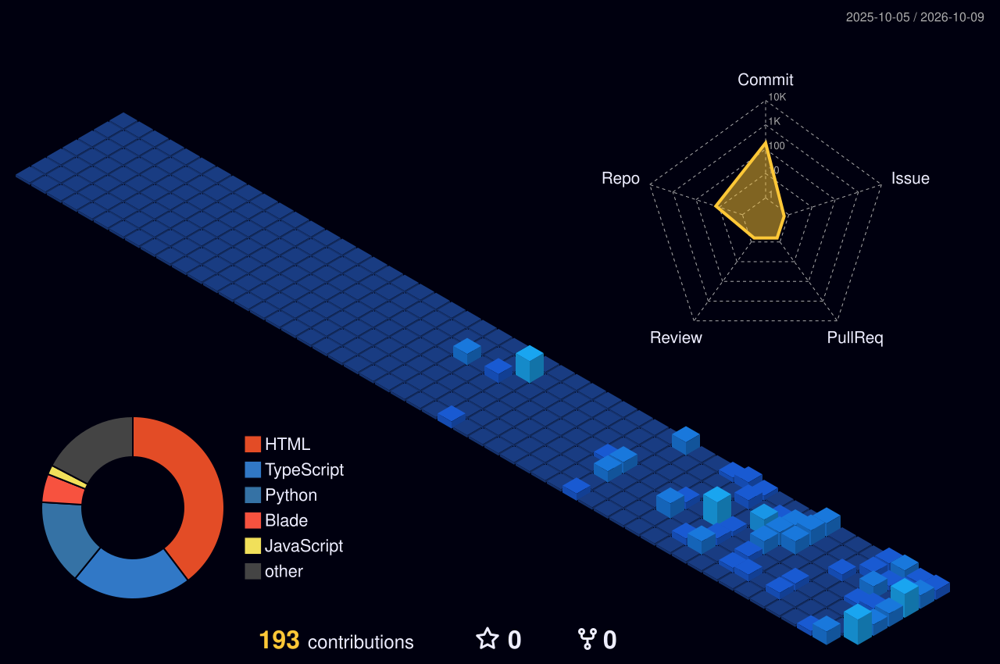

<!-- Animated profile — every SVG below is self-contained (fonts + images inlined). Bump ?v=N after editing an SVG to beat GitHub's image cache. -->

  

  
  
  
  

  

  

  

## 🚀 Featured Projects

| Project | What it is | Stack |
|---|---|---|
| 🏥 **HealthIO** | Role-based healthcare platform for patients, doctors and doctor assistants | `FastAPI` `React` `PostgreSQL` |
| 🍔 **[Smart Street Food Safety](https://github.com/sourav7-1/Food-Safety-System)** | Inspection, hygiene grading and vendor risk analysis for street food | `Flask` `MySQL` `SQLAlchemy` `Leaflet` |
| 🌍 **TerraWatch** | Sentinel-1/2 remote sensing + area condition reports for any drawn region | `Flask` `Earth Engine` `GeoTIFF` |
| 👁️ **[VisionScribe AI](https://github.com/sourav7-1/VisionScribe-AI)** | Local face-presence detection + timestamped multilingual transcripts | `FastAPI` `OpenCV` `Faster-Whisper` |
| ⚡ **Distributed AI Infrastructure** | Pools CPUs/GPUs across machines into one private AI compute cluster *(in progress)* | `FastAPI` `Docker` `Tailscale` |

<b>🏥 HealthIO — AI-Powered Healthcare Management Platform</b>

 

A role-based healthcare platform that connects **patients, doctors, and doctor assistants** in one system. It digitizes the full appointment lifecycle and gives each role its own workflow, so doctors can focus on patients while assistants handle scheduling and coordination.

- **Three-role architecture** — dedicated workflows and dashboards for patients, doctors, and doctor assistants, enforced by role-based access control
- **Appointment management** — patients book appointments; assistants manage, reschedule, and confirm them on a doctor's behalf
- **Doctor-specific patient workflow** — each doctor sees and manages only their own patients and appointments
- **Patient–doctor communication** — direct communication channel within the platform
- **Healthcare information management** — structured storage of patient and appointment data in PostgreSQL
- **AI-assisted features** integrated into the healthcare workflow
- **Responsive interface** built with React, communicating with a FastAPI REST backend

**Tech stack:** `Python` `FastAPI` `React` `PostgreSQL` `REST API`

<b>🍔 Smart Street Food Safety — Inspection & Risk Analysis System</b>

 

A database-driven platform for monitoring **street food hygiene**. It manages vendors, stalls, inspections, complaints, and corrective actions, and turns inspection data into hygiene grades and vendor risk levels to help prioritize enforcement.

- **Multi-role system** — separate access for administrators, inspectors, vendors, and customers
- **Inspection workflow** — inspection → hygiene scoring → grading → corrective action → reinspection scheduling
- **Risk analysis** — vendor risk levels calculated using SQL functions and analytical queries
- **Complaint management** — customers can file complaints that feed into inspection priorities
- **Location features** — map-based stall display and nearby-stall search for customers
- **Analytics dashboard** — charts summarizing inspections, grades, and risk distribution

**Tech stack:** `Python` `Flask` `MySQL` `SQLAlchemy` `JavaScript` `Chart.js` `Leaflet`

<b>🌍 TerraWatch — Sentinel Remote Sensing & GeoAI</b> &nbsp;Built for the DIU AI Hackathon

 

A satellite remote sensing system that collects and processes **Sentinel-1 (radar) and Sentinel-2 (optical) imagery** for any region a user selects — such as a forest — and generates a **report on the area's environmental condition**, along with ML-ready geospatial datasets.

- **Interactive ROI selection** — draw a region of interest directly on a map
- **Automated area reports** — summarizes vegetation and environmental condition of the selected region (e.g. forest health)
- **Sentinel-1 GRD processing** — radar imagery usable regardless of cloud cover
- **Sentinel-2 processing** with automatic cloud filtering
- **Google Earth Engine integration** for large-scale imagery access and processing
- **Multi-band GeoTIFF export** at 10 m spatial resolution
- **Spectral indices** — NDVI, EVI, and NBR for vegetation health and burn analysis
- **Map-based visualization** of processed layers with Leaflet and OpenStreetMap

**Tech stack:** `Python` `Flask` `Google Earth Engine` `Sentinel-1` `Sentinel-2` `GeoTIFF` `Leaflet` `OpenStreetMap`

<b>👁️ VisionScribe AI — Privacy-First Video Analysis & Transcription</b>

 

An AI video analysis system that detects **human face presence** and generates **timestamped speech transcripts** — designed to run fully locally so no video or audio leaves the user's machine.

- **Face presence detection** using SCRFD / InsightFace — detects *whether* a face is present, with no identity recognition
- **Video processing pipeline** with OpenCV for frame-level analysis
- **Audio extraction and transcription** using Faster-Whisper
- **Timestamped transcripts** aligned with the video timeline
- **Bengali and multilingual** speech support
- **Local, private processing** — no cloud dependency

**Tech stack:** `Python` `FastAPI` `OpenCV` `Faster-Whisper` `InsightFace` `SCRFD`

<b>⚡ Distributed AI Infrastructure</b> &nbsp;in progress

 

A platform that pools **CPU and GPU resources from multiple machines** into a single private AI compute environment, so AI workloads can be scheduled across idle hardware instead of one machine.

- **Central controller** that receives jobs and assigns them to worker nodes; **node agents** on each machine report resources and execute jobs
- **Priority-based scheduling** and workload management across nodes
- **GPU and cluster health monitoring** in real time
- **Docker-based execution** for isolated, reproducible workloads
- **Tailscale private networking** to connect machines securely across networks
- **Wake-on-LAN** to power nodes on only when needed
- **React monitoring dashboard** with PostgreSQL-backed resource tracking

**Tech stack:** `Python` `FastAPI` `React` `Docker` `PostgreSQL` `Tailscale`

<b>📂 Other projects</b>

 

| Project | Area | Description |
|---|---|---|
| 🎓 Student360 AI | AI / Education | AI-assisted student information and analytics platform |
| 💰 ZEN Bank Tracker | Web / Backend | Personal finance and transaction tracking system |
| 🍽️ Food Ordering System | Web / Programming | Food ordering application built for system design practice |
| 🤖 Human Following Robot | Robotics | Robot that detects and follows a person |
| 🔐 Digital Combination Lock | Digital Logic | Logic-circuit based security lock system |
| 🎯 Python Study Motivation | Computer Vision | Python/OpenCV computer vision experiment |
| 🎙️ [AI Voice Assistant](https://github.com/sourav7-1/AI-Voice-Assistant-Demo) | AI / Automation | Python-based voice assistant |
| ✅ [FocusFlow](https://github.com/sourav7-1/focusflow) | Laravel / Web App | Laravel web application |

## 🌃 Contribution City

  

## 🏆 Achievements & Certifications

| | Achievement | Details |
|---|---|---|
| 🏅 | **Finalist — DIU AI Project Competition 2026** | Reached the final round |
| 💡 | **Participant — DIU AI Hackathon** | Built **TerraWatch**, a Sentinel satellite remote sensing system that generates an analytical report for any region |
| 🎖️ | **Certificate of Achievement — Web Development with Laravel** | 7-day training by the **National Cyber Security Agency (NCSA), Bangladesh**, with the Dept. of CSE, DIU · Managed by SICL & TechOptions · **Score: 93** · Certificate ID `7464` |
| 📜 | **AI+ Prompt Engineer Level 1™** | AI CERTs™ · June 2025 · Credential ID `576065c59096` |

## 🎓 Education

**B.Sc. in Computer Science & Engineering** — Daffodil International University

Data Structures & Algorithms · Database Management Systems · Distributed Systems · Operating Systems · Computer Networks · Compiler Design · Theory of Computation

  

<i>Build · Learn · Experiment · Improve — turning ideas into working systems.</i>

